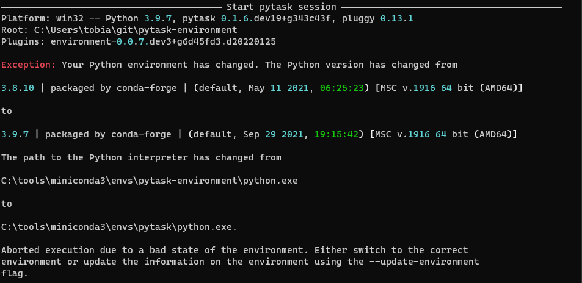

.. image:: https://img.shields.io/pypi/v/pytask-environment?color=blue
    :alt: PyPI
    :target: https://pypi.org/project/pytask-environment

.. image:: https://img.shields.io/pypi/pyversions/pytask-environment
    :alt: PyPI - Python Version
    :target: https://pypi.org/project/pytask-environment

.. image:: https://img.shields.io/conda/vn/conda-forge/pytask-environment.svg
    :target: https://anaconda.org/conda-forge/pytask-environment

.. image:: https://img.shields.io/conda/pn/conda-forge/pytask-environment.svg
    :target: https://anaconda.org/conda-forge/pytask-environment

.. image:: https://img.shields.io/pypi/l/pytask-environment
    :alt: PyPI - License
    :target: https://pypi.org/project/pytask-environment

.. image:: https://img.shields.io/github/workflow/status/pytask-dev/pytask-environment/Continuous%20Integration%20Workflow/main
   :target: https://github.com/pytask-dev/pytask-environment/actions?query=branch%3Amain

.. image:: https://codecov.io/gh/pytask-dev/pytask-environment/branch/main/graph/badge.svg
    :target: https://codecov.io/gh/pytask-dev/pytask-environment

.. image:: https://results.pre-commit.ci/badge/github/pytask-dev/pytask-environment/main.svg
    :target: https://results.pre-commit.ci/latest/github/pytask-dev/pytask-environment/main
    :alt: pre-commit.ci status

.. image:: https://img.shields.io/badge/code%20style-black-000000.svg
    :target: https://github.com/psf/black

------

pytask-environment
==================

pytask-environment allows you to detect changes in your pytask environment and abort a
project build.

Installation
------------

pytask-environment is available on `PyPI <https://pypi.org/project/pytask-environment>`_
and `Anaconda.org <https://anaconda.org/conda-forge/pytask-environment>`_. Install it
with

.. code-block:: console

    $ pip install pytask-environment

    # or

    $ conda install -c conda-forge pytask-environment

Usage
-----

If the user attempts to build the project with ``pytask build`` and the Python version
has been cached in the database in a previous run, an invocation with a different
environment will produce the following command line output.

Running the same command with ``pytask --update-environment`` will update the
information on the environment.

To disable either checking the path or the version, set the following configuration to a
falsy value.

.. code-block:: ini

    check_python_version = False  # True by default

    check_environment = False  # True by default

Future development
------------------

The plugin might be further extended to compare the current environment against an
``environment.yml`` or a list of packages and versions to ensure that the environment is
not altered.

Changes
-------

Consult the `release notes <CHANGES.rst>`_ to find out about what is new.
